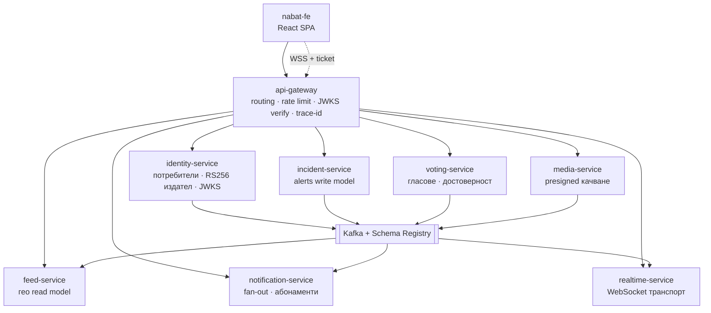

# Целева архитектура

**Статус:** предложение. **Фаза 0 е завършена** (виж раздел 8); останалите фази не са започвани.
**Цел:** Nabat да се превърне в microservice платформа, която е коректна по професионални стандарди и е направена, за да се *учи* от нея. Оптимизирана за учебна стойност и честност, не за скорост на доставяне.

Този документ умишлено е отделен от [`ARCHITECTURE.md`](ARCHITECTURE.md), който описва как системата е *замислена* да работи днес. Прочети раздел „Изходна точка“ по-долу, преди да се довериш на онзи файл — няколко от компонентите, които той документира, не са deploy-нати никъде.

---

## 1. Водещи принципи

1. **Модуларизирай, преди да разпределяш.** Граница, която не е наложена в монолита, няма да издържи превръщането си в мрежово извикване. Всяко изваждане на услуга се предхожда от модул, проверяван по време на build.
2. **Затвори веригата, преди да добавяш услуги.** Инструментация, която не стига до никакъв backend, pipeline, който не публикува image, и gateway, който не съществува, са по-лоши от липсващи — създават фалшива увереност. Това се оправя първо.
3. **Услугата заслужава съществуването си с данни и собствена история за скалиране.** Ако не притежава таблици и се скалира заедно с извикващия я, това е клас, не услуга.
4. **Асинхронно по подразбиране.** Всеки синхронен hop е споделен домейн на отказ. Синхронното се пази за композиция по време на четене, която не може да бъде предварително изчислена.
5. **Никакъв pattern сам за себе си.** Една истинска saga, защото има една истинска разпределена транзакция. Никакво event sourcing там, където таблица със текущо състояние е коректна. Over-engineering-ът учи на по-лоши неща от under-engineering-а.
6. **Документацията описва това, което е deploy-нато.** Стремежите се пишат в този файл и се маркират като такива.

---

## 2. Изходна точка: какво реално съществува днес

Установено с одит. Факти, с посочени източници.

### Работи и си струва да се запази

| Какво | Къде |
|---|---|
| Хексагонални слоеве с домейн без framework зависимости, наложени чрез тестове | `ArchitectureTest.java:44-57` |
| Fail-closed авторизация (`anyRequest().denyAll()`) в двете услуги | `SecurityConfig.java:56` |
| Валидация на JWT secret: дължина, ентропия, blocklist за placeholder-и, без default | `JwtTokenProvider.java:95-118` |
| Отнемане на токени през `tv` (token-version) claim | `JwtAuthenticationFilter.java:87` |
| Еднократна ротация на refresh токени с `jti`, върху Redis | `RedisRefreshTokenStore` |
| WebSocket автентикация с краткоживеещ ticket, а не bearer токен в query string-а | `WebSocketTicketController`, `JwtHandshakeInterceptor` |
| Kafka хигиена при producer/consumer: `acks=all`, идемпотентност, error handler с ограничен backoff, `commitRecovered` | nabat-voting `KafkaConfig.java:122-198` |
| Идемпотентен rebuild на проекцията, с отделна транзакция за всеки alert | nabat-voting `CredibilityProjectionUpdater.java:77-98` |
| Собствени метрики по use-case с тагове за success/error | `UseCaseMetricsAspect.java:43-61` |
| Разпознаване по време на изпълнение дали има PostGIS, или се пада на Haversine | `SpatialCapabilityDetector` |
| Фронтенд: един споделен in-flight refresh promise, WS reconnect с експоненциален backoff и възстановяване на пропуснатия интервал | `client.ts:110-166`, `useWebSocket.ts:45-56` |

### Не работи или не съществува

| Твърдение | Реалност |
|---|---|
| Kong API gateway | **Съществува и работи, но само на една машина и не е във version control.** Няма `kong.yml` в нито едно от трите repo-та, липсва в двата compose файла и в Helm chart-а; config repo-то, което `ARCHITECTURE.md:234` обещава, не е качено. Значи никоя среда, възпроизводима от git, няма Kong — включително Kubernetes deploy-ът, където Ingress-ът сочи право към `nabat-app:8080`. |
| Rate limiting / защита от brute force | `RateLimitingFilter` и bucket4j са изтрити, защото Kong поема това. Работи там, където Kong работи. **Липсва във всяка среда, която може да се вдигне от repo-то** — compose, Helm, CI, машината на всеки друг разработчик. `LoginAttemptTracker` само наблюдава и логва; това е умишлено при gateway, но означава, че без Kong пред себе си приложението не блокира нищо. |
| Събиране на метрики | Prometheus в Helm няма `metrics_path`, така че scrape-ва `/metrics`, а Spring сервира `/actuator/prometheus` → 404 при всеки scrape. В compose се използва label-based discovery, но нито една услуга не декларира labels и docker socket-ът не е mount-нат. Никъде не се събира нищо. |
| CD pipeline | CI строи images върху runner-а и ги хвърля — няма registry, няма push. `deploy.yml` реферира `nabat-app:${sha}` с `imagePullPolicy: IfNotPresent`, никога не подава задължителния `global.jwtSecret`, и deploy-ва nabat-voting с *SHA на nabat-app*. Не може да успее на чист кластер. |
| Readiness gating | Нула `readinessProbe` в трите repo-та, при `nabatApp.replicas: 2`. Liveness удря агрегатния `/actuator/health`, така че кратък проблем с Postgres рестартира здрави pod-ове. Health groups на Spring не са включени никъде. |
| `k8s/` манифести | Мъртви, дрифтнали, нереферирани. Колидират с chart-а по Namespace, `nabat-secrets`, `nabat-uploads` и Deployment/Service `nabat-app`, с несъвместими immutable label selectors. |
| Трайност на мониторинга | Prometheus, Loki и Grafana ползват `emptyDir`; Zipkin няма `STORAGE_TYPE`. Стойностите `storage:` в `values.yaml` са мъртви — не се създава PVC. Няма Alertmanager, няма правила за алармиране, няма дашборди. |
| Структурирано логване | Няма logback конфигурация в нито една от двете услуги. Promtail изпраща ANSI-оцветен свободен текст към Loki без парсване; trace ID-тата не могат да се извлекат като labels. |
| Event-driven комуникация между услугите | **nabat-app изобщо няма Kafka.** Topic-ът `vote.cast` е self-loop: nabat-voting сам публикува и сам консумира своите събития, за да поддържа собствената си проекция. Cross-service поток от събития не съществува. |
| Resilience | Няма Resilience4j никъде. Извикването nabat-app → nabat-voting има connect/read timeout и нищо друго — без circuit breaker, retry или bulkhead. |
| Автоматизация на фронтенда | nabat-fe няма CI, няма запис в compose, няма Kubernetes манифест. `VITE_API_BASE_URL` се вгражда по време на build; `.env.example` сочи порт 8000 (Kong), а `vite.config.ts` по подразбиране го заобикаля към 8080 — двата default-а си противоречат, защото Kong не е в compose. |

### Бъгове в коректността, открити при одита

1. ✅ **`GET /api/v1/auth/me` не беше автентикиран.** `permitAll` върху `/api/v1/auth/**` се оценяваше преди `authenticated()`, а `AuthController` твърди обратното и заради това няма null проверка — анонимна заявка стигаше до `UserResponse.from(null)` и връщаше **500 с `NullPointerException`** вместо 401. Публичният списък вече е изброен по метод и път. Покрито от `AuthEndpointSecurityTest`, който не иска Docker — съществуващият Testcontainers тест очакваше 401, но се пропускаше точно там, където човек би забелязал.
2. ✅ **WebSocket push се случваше вътре в транзакция.** Сега `CreateAlertService` само записва и публикува `AlertCreated`; `NewAlertFanout` работи след commit, асинхронно, в собствена транзакция.
3. ✅ **Мъртва port surface:** `AlertRepository.findVoteStats`, съответният JPA projection и `NotificationSender.isUserOnline` са премахнати.
4. 🟡 **Непокрити с тестове области.** media модулът вече има 23 теста (magic bytes, service, controller headers). Остават без покритие Redis адаптерите, `NabatVotingRestClientAdapter` и `SmtpEmailSender`; няма Redis Testcontainer никъде.
5. 🟡 **Дублирана политика за fan-out.** Логиката severity→радиус се премести в `NewAlertFanout`, но все още е кодирана твърдо и отделно от `NotificationRadius`. Обединява се във Фаза 6, когато notification поеме абонаментите.

---

## 3. Целева топология

### Отговорности на услугите

| Услуга | Притежава | Защо е услуга |
|---|---|---|
| **api-gateway** | нищо | Само edge грижи: TLS, верификация на JWT срещу JWKS, rate limiting, инжектиране на request-id, маршрутизиране. Никаква домейн логика — точно това го прави gateway, а не BFF. |
| **identity-service** | `users`, `verification_tokens`, състояние на refresh токените | Единственият издател на токени в системата. Подписва с RS256, публикува JWKS. Скалира се независимо (пикове при login) и е най-строгата граница по сигурност. |
| **incident-service** | `alerts` (write model) | Ядрото на домейна. Това остава от nabat-app, след като отпадне всичко останало. |
| **feed-service** | гео read model (Redis GEO / PostGIS реплика) | Единственото място, където CQRS е оправдан: заявки по радиус при висок QPS нямат нищо общо с пътя на записване. Сервира картата с вече присъединени тallies от гласуването и URL на снимката — без fan-out по време на заявка. |
| **voting-service** | `votes`, `alert_credibility` | Вече е извадена. Най-висок процент на записи в системата; независимото скалиране е реално. |
| **notification-service** | `notifications`, `user_subscriptions`, предпочитания за нотификации | Чист event consumer. Притежава *цялата* политика „кой за какво трябва да чуе“ — което решава и дублираната логика за радиуса. |
| **realtime-service** | регистър на връзките (Redis) | 50k неактивни socket-а и 50 записа/сек са несвързани проблеми на скалиране. Redis relay индирекцията вече съществува. |
| **media-service** | метаданни за object storage | Издава presigned URL-и, така че байтовете никога не минават през услугата; заменя адаптера върху локална файлова система, който не може да работи при `replicas: 2`. |

Умишлено **не** са услуги: изпращач на имейли (няма данни, скалира се с извикващия), „гео помощна услуга“, „услуга за auth филтъра“. Това са библиотеки или класове.

---

## 4. Собственост върху данните

Сегашната схема има пет таблици в един Postgres, с истински FK-и и `users` като хъб в четири посоки. Разделянето означава всеки cross-context FK да се превърне в реферирано ID плюс — там, където join е нужен по време на четене — локално притежавана проекция, захранвана от събития.

| Таблица | Бъдещ собственик | Cross-context FK-и днес | Превръща се в |
|---|---|---|---|
| `users` | identity | — (цел на 4 FK-а) | Хъбът изчезва. Останалите услуги държат `user_id` като непрозрачна стойност. |
| `verification_tokens` | identity | → `users` | Остава заедно с `users`. |
| `alerts` | incident | → `users` (`reported_by`) | `reported_by` става UUID без наложено ограничение. |
| `user_subscriptions` | notification | → `users` | Мести се изцяло; notification притежава геозоната. |
| `notifications` | notification | → `users` ×2, → `alerts` ×1 | **Най-трудният ред за разделяне** — три cross-context референции. Полетата за показване (име на актьора, заглавие на алерта) се денормализират при запис; нотификацията е неизменен исторически запис, така че снапшотът е коректният модел, не компромис. |

### Колони, които вече са cross-context

Това са шевовете, видими в схемата днес:

- **`alerts.upvote_count / downvote_count / confirmation_count / credibility_score`** — денормализирана проекция на състоянието на voting услугата, в момента записвана синхронно от HTTP отговора на гласуването през `AlertRepositoryAdapter.applyVoteCounts`. **В целевата архитектура това е Kafka consumer на събитията за гласове.** Именно тази промяна превръща сегашния self-loop в истински cross-service поток и е стъпката с най-висока учебна стойност в цялата миграция.
- **`users.notification_radius_km / last_known_lat / last_known_lng`** — данни за маршрутизиране на нотификации, живеещи върху identity агрегата, заявявани само от fan-out при създаване на alert (`findUsersNearLocation`). Местят се в notification-service, захранвани от събитие `user.location_updated`.
- **`alerts.photo_url`** — media данни върху incident ред, подавани от клиента без каквато и да е серверна връзка към съхранения файл и без път за изчистване. В целевата архитектура media-service притежава обекта и излъчва `media.attached`.
- **`users.token_version`** — чете се от Postgres при **всяка** автентикирана заявка (`JwtAuthenticationFilter.java:75-90`). Това не издържа изваждане: cross-service извикване при всяка заявка е недопустимо. Цел: краткоживеещи access токени (≈15 мин) плюс списък за отнемане, разпространяван чрез събитие, така че всяка услуга да проверява локално.

---

## 5. Каталог на събитията

Контрактите са Avro или Protobuf в Schema Registry с наложена backward compatibility. JSON без registry е начинът, по който event-driven системите се разпадат. Всеки producer пише през **transactional outbox** — никога директен publish вътре в транзакция към базата.

| Topic | Ключ | Producer | Consumers | Бележки |
|---|---|---|---|---|
| `user.registered` | `user_id` | identity | notification | Задейства приветствена нотификация. |
| `user.location_updated` | `user_id` | identity | notification | Захранва индекса на геозоните. |
| `user.credentials_invalidated` | `user_id` | identity | всички услуги | Разпространява отнемането; заменя четенето на `token_version` от базата при всяка заявка. |
| `incident.created` | `incident_id` | incident | feed, notification, realtime | Спусъкът за fan-out. |
| `incident.updated` | `incident_id` | incident | feed, realtime | |
| `incident.resolved` | `incident_id` | incident | feed, notification, realtime | |
| `vote.cast` | `incident_id` | voting | feed, notification, incident | Ключът е по incident, за да останат всички гласове за един incident подредени в един дял. |
| `vote.removed` | `incident_id` | voting | feed, notification, incident | |
| `media.uploaded` | `media_id` | media | media (thumbnails), incident (изчистване на осиротели файлове) | |

**Правила за consumer-ите.** At-least-once доставка означава, че всеки consumer трябва да е идемпотентен. Два приемливи подхода: преизчисляване от източник на истината (което проекцията на nabat-voting вече прави правилно) или dedupe ключ за всяко `(consumer, event_id)`. Никога не приемай exactly-once.

**Подредба.** Ключ по id на агрегата гарантира подредба за конкретния агрегат в рамките на един дял. Нищо не бива да зависи от подредба *между* агрегати.

---

## 6. Синхронни извиквания

Асинхронното е по подразбиране. Следните синхронни hop-ове са разрешени, всеки с посочена причина:

| Извикващ → извикван | Причина | Задължителна защита |
|---|---|---|
| gateway → която и да е услуга | Request/response е контрактът с клиента | Timeout, retry само за идемпотентни методи, circuit breaker |
| която и да е услуга → identity JWKS | Ключов материал, кеширан с часове | Кеш със stale-on-error; никога не се отказва заявка заради неуспешно взимане на JWKS |
| feed → нищо | Read model-ът е пълен по конструкция | — |

Всеки синхронен hop използва Resilience4j: timeout, bulkhead, circuit breaker и retry с jitter — само за идемпотентни операции. Гол `RestClient` към друга услуга е дефект.

**Една истинска saga:** създаване на incident със снимка. Снимката се качва, преди incident-ът да съществува, така че неуспешно създаване оставя осиротял обект. Компенсация: media-service изчиства обектите, които не получат `media.attached` в рамките на TTL. Това е единствената разпределена транзакция в системата — не бива да се измислят други, за да се демонстрира pattern-ът.

---

## 7. Изисквания към платформата

Непреговаряеми, преди броят на услугите да расте. Разпределена система без тях е недебъгваема, което е точно погрешният урок.

**Observability.** OpenTelemetry от край до край, с trace context, пренасян и през Kafka headers — не само през HTTP. Prometheus, който scrape-ва *правилния* път, с трайно съхранение. Структурирани JSON логове, носещи `trace_id`, парсван в Loki labels. Grafana дашборди, версионирани като код. Alertmanager с правила, които значат нещо. Exporter-и за Postgres, Redis, Kafka и JVM.

**Доставяне.** По един pipeline на услуга: build → тестове → сканиране (Trivy + CodeQL + secret scan) → SBOM → push към registry с immutable таг → deploy. Images се реферират по digest. Contract тестове (Pact или Spring Cloud Contract), които пазят всяка двойка consumer/producer. `helm lint` и `kubeconform` в CI. GitOps (Argo CD) за deploy, така че състоянието на кластера да е git артефакт.

**Runtime.** Readiness *и* liveness probes чрез health groups на Spring, така че проблем със зависимост да изважда pod-а от ротация, вместо да го рестартира. Requests и limits на всеки workload. HPA върху двете услуги с най-висок throughput. PodDisruptionBudget-и. NetworkPolicy-та, които отказват по подразбиране. `securityContext` с `runAsNonRoot` и read-only root файлова система — image-ът на nabat-voting в момента се изпълнява като root.

**Сигурност.** RS256 с JWKS, така че само identity да може да издава токени. Rate limiting на gateway-а. Secrets през External Secrets Operator или Sealed Secrets, никога commit-нати и никога в plaintext във `values.yaml`. Refresh токен в httpOnly cookie, access токен в паметта — `localStorage` прави всеки XSS пълна кражба на сесията, както `nginx.conf:8-10` вече признава.

---

## 8. План за миграция

Strangler fig. Всяка фаза оставя системата deploy-ваема и има критерий за завършване, който може да се демонстрира, а не само да се твърди.

### Фаза 0 — Модуларизация на място ✅ ЗАВЪРШЕНА

Никакви нови услуги. Възстанови Spring Modulith както трябва: декларирай модули (`identity`, `incident`, `notification`, `subscription`, `realtime`, `media`, `voting`) и ги наложи с `ApplicationModules.verify()` в build-а. Замени собствения `ArchitectureTest` с ArchUnit плюс верификацията на Modulith. Преобразувай вътрешнопроцесните извиквания между фичърите — най-вече fan-out-а в `CreateAlertService` — в домейн събития през `@ApplicationModuleListener`.

Тази фаза има най-голям ефект от всичко в документа. Event Publication Registry на Modulith *е* transactional outbox, така че учи pattern-а в рамките на един процес, където може да се дебъгва, а всяко следващо изваждане става механично: модулът вече е услугата.

**Критерий за завършване:** `ApplicationModules.verify()` минава; нито един модул не импортира вътрешности на друг; fan-out-ът при alert е event-driven; WebSocket push-ът е извън транзакцията.

**Изпълнено.** 133 файла в main и 34 теста преместени във девет модула плюс `shared` и `platform`. `ApplicationModules.verify()` минава. Заедно с това:

- Три цикъла, които достъпът в рамките на пакета беше скривал: `realtime ↔ incident/notification` (обърнат с `WsBroadcaster` — производителят строи frame-а, транспортът само маршрутизира), `notification ↔ voting` (преводът `VoteType → NotificationType` мина при извикващия), `incident ↔ subscription` (обърнат с `AlertAudiencePort`).
- ArchUnit замени скенера на импорти. Седмото правило извади дупка: `UploadController` беше единственият контролер, инжектиращ outbound порт — media вече има application слой.
- `NotificationMilestones` мина в `notification/domain`; два `@Deprecated(forRemoval = true)` тестови shim-а са премахнати.
- **Остава от тази фаза:** Event Publication Registry (durability на fan-out-а) — иска `spring-modulith-events-jpa`, което не е налично локално. И `spring-modulith-docs` за генериране на C4 диаграми от кода.

### Фаза 1 — Платформата да стане реална

Registry и push на images. Поправен scrape път за Prometheus. Readiness/liveness health groups. Структурирано JSON логване с парсване на trace-id. **Декларативната Kong конфигурация влиза в git**, влиза в compose и в Helm chart-а, а Ingress-ът сочи към Kong вместо право към приложението — така rate limiting-ът съществува във всяка среда, не само на една машина. Изтриване на `k8s/`. Трайно съхранение за мониторинг стека. `securityContext` и non-root image за voting. CI за nabat-fe.

**Критерий:** един commit deploy-ва на чист кластер без ръчна намеса; trace на заявка се вижда от край до край в Grafana; ограничен по rate клиент получава 429; описанието в ARCHITECTURE.md отговаря на реалността.

### Фаза 2 — Event backbone-ът да стане реален

Kafka в nabat-app. Schema Registry с Avro. Transactional outbox в двете услуги. **Замяна на синхронния запис на броя гласове с consumer на `vote.cast`** — self-loop-ът става истински cross-service поток. Resilience4j върху останалия синхронен hop.

**Критерий:** voting-service може да бъде спряна и гласовете все пак се съгласуват след време; несъвместима промяна на схема се отхвърля от CI.

### Фаза 3 — RS256 и JWKS

Identity подписва с частен ключ; всяка друга услуга верифицира срещу публикуван JWKS. TTL на access токена — до ~15 минути. Отнемането се разпространява чрез събитие вместо четене от базата при всяка заявка. `kid` headers, за да могат ключовете да се ротират без прекъсване.

**Критерий:** никоя услуга освен identity не държи материал за подписване; ключ се ротира без нито една неуспешна заявка.

### Фаза 4 — Изваждане на media-service

Най-чистият възможен разрез: без FK свързаност, без тестове за пренасяне, а сегашният адаптер вече е документиран като неработещ при две реплики. Преминаване към presigned S3/MinIO URL-и и решаване на факта, че `GET /api/v1/uploads/{filename}` в момента изисква JWT, което прави CDN кеширане невъзможно.

**Критерий:** снимките преживяват рестарт на pod и се четат от която и да е реплика.

### Фаза 5 — Изваждане на realtime-service

Redis relay-ът вече съществува, така че това е предимно промяна в deployment-а. Първо трябва да се разчупи свързването, при което `AlertWebSocketHandler` импортира REST DTO-та (`AlertResponse`, `NotificationResponse`) — форматът по мрежата трябва да стане собствен версиониран контракт.

**Критерий:** realtime се скалира независимо; rolling restart на incident-service не разпада socket-ите.

### Фаза 6 — Изваждане на notification-service (заедно с абонаментите)

Един bounded context, не два: и двата са за това кой за какво чува. Поема геозоновата заявка, предпочитания за радиус на потребител и политиката по severity, кодирана в момента твърдо в incident пътя. Полетата за показване в нотификациите се денормализират при запис.

**Критерий:** таблиците `notifications` и `user_subscriptions` живеят в собствена база; дублираната политика за радиуса има един дом.

### Фаза 7 — Изваждане на identity-service, добавяне на feed-service

Identity е последна: четири входящи FK-а и най-строгата повърхност по сигурност — изважда се само след като tracing и contract тестове могат да го докажат. После feed-service като read model, в който момент nabat-app е чисто incident-service.

**Критерий:** всяка услуга притежава собствена база; не остава нито един cross-service FK.

---

## 9. Anti-pattern-и, които този дизайн отказва

| Anti-pattern | Защо се отхвърля |
|---|---|
| Споделена база | Разпределен монолит с добавена latency и без независим deploy. |
| Споделен `common-domain` jar | Свързва отново всички услуги по време на компилация; всяка промяна става deploy в крак. Споделяй контракти (схеми), никога домейн типове. |
| Nanoservices | Услуга без данни и без собствена история за скалиране е клас. |
| Разделяне по слоеве | „Controller услуга“, която вика „repository услуга“, разпределя слоевете, не домейна. |
| Разпределени транзакции / 2PC | Никога. Вместо това saga с явна компенсация. |
| Театър със saga-и | Има точно една истинска saga. Измислянето на още, за да се покаже pattern-ът, изгражда грешен инстинкт. |
| Kafka като вътрешнопроцесен message bus | Сегашният self-loop на `vote.cast`: latency и dual-write риск за нулево decoupling. |
| Event sourcing по подразбиране | Таблицата `votes` е коректна като текущо състояние. Event sourcing там, където историята е изискване, не като украса. |
| Инфраструктура извън version control | Случаят с Kong: работи на една машина, но нито едно repo не може да го вдигне, така че всяка друга среда тихо остава без gateway и без rate limiting. Конфигурацията на нещо, което стои пред всички услуги, е код. |
