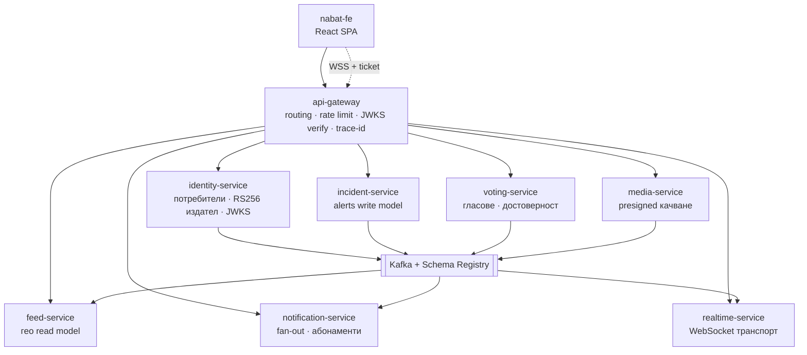

# Целева архитектура

**Статус:** предложение. **Фаза 0 е завършена; Фаза 1 е изпълнена дотам, докъдето има смисъл** (виж раздел 8). Фази 2–7 не са започвани, но част от предпоставките им вече са налице. **Последно сверено с кода: 2026-08-26.**

> **Обхват (решено 2026-08-25).** Това е личен проект и няма да стигне production среда.
> Документът е писан с production тон, защото описва как се прави нещо правилно, но
> критериите се четат като **упражнения, не като задължения**. Практическото следствие е
> в раздел 7 и във Фаза 1: нещата, чиято единствена стойност е оперативна безопасност на
> реална система — OIDC вместо дълготраен `KUBECONFIG`, staging tier, Trivy/CodeQL/SBOM,
> PodDisruptionBudget, NetworkPolicy, достижим от CI кластер — **не са дългове**. Ръчният
> `helm upgrade` от машината с minikube е окончателният отговор. Дълг остава само това,
> което пречи да се учи: непроверимо поведение, липсващи среди, тихо счупени пътища.
**Цел:** Nabat да се превърне в microservice платформа, която е коректна по професионални стандарди и е направена, за да се *учи* от нея. Оптимизирана за учебна стойност и честност, не за скорост на доставяне.

Този документ умишлено е отделен от [`ARCHITECTURE.md`](ARCHITECTURE.md), който описва как системата е *замислена* да работи днес. Прочети раздел „Изходна точка“ по-долу, преди да се довериш на онзи файл — няколко от компонентите, които той документира, не са deploy-нати никъде.

---

## 1. Водещи принципи

1. **Модуларизирай, преди да разпределяш.** Граница, която не е наложена в монолита, няма да издържи превръщането си в мрежово извикване. Всяко изваждане на услуга се предхожда от модул, проверяван по време на build.
2. **Затвори веригата, преди да добавяш услуги.** Инструментация, която не стига до никакъв backend, pipeline, който не публикува image, и gateway, който не съществува, са по-лоши от липсващи — създават фалшива увереност. Това се оправя първо.
3. **Услугата заслужава съществуването си с данни и собствена история за скалиране.** Ако не притежава таблици и се скалира заедно с извикващия я, това е клас, не услуга.
4. **Асинхронно по подразбиране.** Всеки синхронен hop е споделен домейн на отказ. Синхронното се пази за композиция по време на четене, която не може да бъде предварително изчислена.
5. **Никакъв pattern сам за себе си.** Една истинска saga, защото има една истинска разпределена транзакция. Никакво event sourcing там, където таблица със текущо състояние е коректна. Over-engineering-ът учи на по-лоши неща от under-engineering-а.
6. **Документацията описва това, което е deploy-нато.** Стремежите се пишат в този файл и се маркират като такива.

---

## 2. Изходна точка: какво реално съществува днес

Установено с одит. Факти, с посочени източници.

### Работи и си струва да се запази

| Какво | Къде |
|---|---|
| Хексагонални слоеве с домейн без framework зависимости, наложени чрез тестове | `ArchitectureTest` (ArchUnit, 7 правила) |
| Fail-closed авторизация (`anyRequest().denyAll()`) в двете услуги | `SecurityConfig.java:78` |
| Валидация на JWT secret: дължина, ентропия, blocklist за placeholder-и, без default | `JwtTokenProvider.java:95-118` |
| Отнемане на токени през `tv` (token-version) claim, с едно решение за всички входни точки | `SessionAuthenticationService` зад `AuthenticateSessionUseCase` |
| Еднократна ротация на refresh токени с `jti`, върху Redis | `RedisRefreshTokenStore` |
| WebSocket автентикация с краткоживеещ ticket, а не bearer токен в query string-а — и двата пътя минават през същата проверка на сесията като HTTP филтъра | `WebSocketTicketController`, `JwtHandshakeInterceptor` |
| Transactional outbox в рамките на процеса, с преиграване на незавършените публикации при старт | `event_publication` (V11), `NewAlertFanout` |
| Обектно съхранение за снимки, избирано с конфигурация, плюс изчистване на осиротели файлове | `S3StorageAdapter`, `StorageConfig`, `OrphanedPhotoReclaimService` |
| Разделени liveness/readiness health groups, така че отпадане на базата да не рестартира здрави pod-ове | `application.properties`, `HealthProbesIntegrationTest` |
| Декларативна Kong конфигурация във version control, споделена от compose и Helm | `helm/nabat/kong/kong.yml` |
| Структурирани JSON логове с `traceId`, пренасян и през `@Async` границата | `logging.structured.format.console`, `AsyncConfig`, `StructuredLoggingIntegrationTest` |
| Testcontainers за PostGIS **и** Redis, споделени за целия JVM | `PostgresTestSupport` |
| Kafka хигиена при producer/consumer: `acks=all`, идемпотентност, error handler с ограничен backoff, `commitRecovered` | nabat-voting `KafkaConfig.java:122-198` |
| Идемпотентен rebuild на проекцията, с отделна транзакция за всеки alert | nabat-voting `CredibilityProjectionUpdater.java:77-98` |
| Собствени метрики по use-case с тагове за success/error | `UseCaseMetricsAspect.java:43-61` |
| Разпознаване по време на изпълнение дали има PostGIS, или се пада на Haversine | `SpatialCapabilityDetector` |
| Фронтенд: един споделен in-flight refresh promise, WS reconnect с експоненциален backoff и възстановяване на пропуснатия интервал | `client.ts:110-166`, `useWebSocket.ts:45-56` |

### Не работи или не съществува

| Твърдение | Реалност |
|---|---|
| Kong API gateway | ✅ **Вече е във version control и в двете среди.** `helm/nabat/kong/kong.yml` е каноничният декларативен конфиг — `docker-compose.yml` го mount-ва, chart-ът го рендерира (`kong.yaml`), а Ingress-ът сочи към Kong вместо към `nabat-app:8080`. Файлът живее под chart-а, защото `.Files.Get` на Helm не чете извън директорията на chart-а, и един файл за двете среди струва повече от по-подреден път плюс дрифт. CI чупи build-а, ако конфигът се рендерира празен. |
| Rate limiting / защита от brute force | ✅ **Съществува навсякъде, където има Kong.** `kong.yml` носи два `rate-limiting` плъгина и `request-size-limiting`; Kong е и в compose, и в chart-а. `LoginAttemptTracker` продължава само да наблюдава и логва — умишлено, когато gateway стои отпред. Остава: `mvnw spring-boot:run` без gateway не ограничава нищо, тоест защитата е свойство на топологията, не на приложението. |
| Събиране на метрики | ✅ **Поправено в двете среди.** И `prometheus.yml` (compose), и `prometheus-config.yaml` (Helm) задават `metrics_path: /actuator/prometheus` за двете услуги, а метриките на Kong се взимат от status listener-а на 8100, не от Admin API — двата пътя сервират `/metrics`, но само единият е и control surface, способен да замени цялата конфигурация на gateway-а. Остава: target-ът `nabat-voting` в compose не се решава, защото услугата е в отделен compose stack; оставен е нарочно видимо DOWN, вместо да бъде тихо премълчан. |
| CD pipeline | 🟡 **Работи, но е ръчен по конструкция.** Images се публикуват в GHCR с immutable SHA таг; `helm lint`, `helm template`, `kubeconform` и проверката за празен Kong конфиг вървят в CI. `deploy.yml` обаче е **само `workflow_dispatch`**: целевият кластер е локален minikube, а GitHub-hosted runner не може да го достигне — API server-ът слуша на `127.0.0.1` или на Docker-вътрешен адрес, който на runner-а се решава до самия runner. Всеки merge даваше червен Deploy за кластер, недостижим по конструкция, а pipeline, който се чупи по замисъл, учи хората да игнорират червено. Остава: достижим кластер (managed или self-hosted runner), OIDC вместо дълготраен `KUBECONFIG`, staging tier, Trivy/CodeQL/SBOM, contract тестове. |
| Readiness gating | ✅ **Има го за nabat-app.** `/actuator/health/liveness` и `/actuator/health/readiness` са отделни групи: liveness не носи външна зависимост, защото рестартът не поправя Postgres, а readiness добавя `db`. Redis нарочно **не** е в readiness — всички реплики ползват една инстанция, така че включването му превръща частична деградация в едновременно излизане на всички pod-ове от балансировчика. Пинато от `HealthProbesIntegrationTest`. Остава: `voting-app` има само `livenessProbe`. |
| `k8s/` манифести | ✅ Изтрити. Бяха мъртви, дрифтнали и нереферирани, и колидираха с chart-а по Namespace, `nabat-secrets`, `nabat-uploads` и Deployment/Service `nabat-app` — прилагането им върху Helm release изтриваше JWT secret-а. Историята им е в git, ако някога потрябват. |
| Алармиране и дашборди | ✅ **Има ги, като код и в двете среди.** Alertmanager е услуга в compose и в chart-а; правилата (`helm/nabat/prometheus/rules.yml`), маршрутизацията (`alertmanager/alertmanager.yml`) и таблото (`grafana/dashboards/nabat-overview.json`) са споделени файлове, а не две копия, които се разминават. Доставката отива към MailHog — избран нарочно вместо webhook към нищото, защото верига за алармиране, чийто последен hop е непроверим, е точно проблемът, който целият този раздел описва. Шест правила върху метрики, които реално съществуват: `ServiceDown`, `VotingServiceUnreachable` (warning, не critical — в compose тази цел законно липсва), `HighServerErrorRate`, `HighRequestLatency`, `UseCaseErrorRate`, `ConnectionPoolSaturated`, `HeapNearlyFull`. **Остава:** нито едно правило не гледа домейн състояние — най-ценното липсващо е gauge за незавършени редове в `event_publication`, защото натрупването там значи, че durable fan-out-ът се проваля тихо. |
| Трайност на мониторинга | 🟡 **Поправено в голяма част.** Prometheus, Loki и Grafana вече имат PVC — `monitoring.*.storage` бяха настройвани и четени от нищо, тоест `values.yaml` документираше трайност, която chart-ът не даваше. Deployment-ите минаха на `strategy: Recreate`, защото ReadWriteOnce том не се mount-ва от нов pod, докато старият го държи — това е блокировка, не бавен rollout. Zipkin вече заявява `STORAGE_TYPE: mem` явно: ring buffer, който умира с контейнера, което е приемливо за учебен кластер и неприемливо да се открие случайно. **Остава:** трайно tracing изисква Elasticsearch/Cassandra — спановете още умират с pod-а. |
| Структурирано логване | ✅ **Готово и в двете среди.** `logging.structured.format.console=${NABAT_LOG_FORMAT:}` дава ECS JSON в deployment-ите и плосък текст локално; Boot 3.4 носи формата вграден. **Promtail в chart-а не изпращаше нищо** — не липсваше само парсване: `kubernetes_sd_configs` намираше pod-ове, но без `__path__` relabel promtail няма файл за четене, защото е file tailer, а не log API клиент. Сега има `__path__`, `cri: {}` за обвивката на kubelet и същите `json`/`labels`/`timestamp` стъпки като в compose. Двете конфигурации не могат да се слеят в една: през Docker discovery редът пристига гол, а през kubelet — обвит. Пинато от `StructuredLoggingIntegrationTest`. Две подробности, които спестяват час: ECS ключовете са плоски с точки (`service.name`), а tracing идва като `traceId`/`spanId`, не като каноничния `trace.id` — MDC се излъчва като динамични двойки, така че `logging.structured.json.rename.*` не го достига. |
| Tracing до backend | ✅ **Поправено.** Приложението винаги е било конфигурирано да изпраща спанове (`micrometer-tracing-bridge-brave` + zipkin reporter, sampling 1.0), но `ZIPKIN_ENDPOINT` се разчиташе на default-а `http://nabat-zipkin:9411`: в compose такава услуга изобщо нямаше, тоест всеки export падаше на DNS, а в chart-а името се решаваше само докато release-ът се казва `nabat`. Сега Zipkin е услуга в compose, а endpoint-ът се задава явно в двете среди — от service name, съответно от `fullname`. |
| Event-driven комуникация между услугите | ❌ **Непроменено.** `pom.xml` на nabat-app няма нито Kafka, нито Resilience4j — проверено. `kafka.yaml` в chart-а е за nabat-voting. Topic-ът `vote.cast` остава self-loop: nabat-voting сам публикува и сам консумира. Спечеленото междувременно е pattern-ът, не транспортът — Event Publication Registry (V11) е transactional outbox в рамките на един процес, тоест Фаза 2 подменя носителя, а не идеята. |
| Resilience | ❌ Няма Resilience4j никъде. Извикването nabat-app → nabat-voting има connect/read timeout и нищо друго — без circuit breaker, retry или bulkhead. Отказите се превеждат коректно (503 при timeout/5xx), но не се поглъщат. |
| Автоматизация на фронтенда | 🟡 nabat-fe все още няма CI, няма запис в compose и няма Kubernetes манифест. Противоречието в default-ите обаче е решено: `.env.example` документира двата режима (Kong на 8000 срещу приложението право на 8080), а `vite.config.ts` derive-ва proxy target-а от `VITE_API_BASE_URL` с default 8080 и обяснение защо. |

### Бъгове в коректността, открити при одита

1. ✅ **`GET /api/v1/auth/me` не беше автентикиран.** `permitAll` върху `/api/v1/auth/**` се оценяваше преди `authenticated()`, а `AuthController` твърди обратното и заради това няма null проверка — анонимна заявка стигаше до `UserResponse.from(null)` и връщаше **500 с `NullPointerException`** вместо 401. Публичният списък вече е изброен по метод и път. Покрито от `AuthEndpointSecurityTest`, който не иска Docker — съществуващият Testcontainers тест очакваше 401, но се пропускаше точно там, където човек би забелязал.
2. ✅ **WebSocket push се случваше вътре в транзакция.** Сега `CreateAlertService` само записва и публикува `AlertCreated`; `NewAlertFanout` работи след commit, асинхронно, в собствена транзакция.
3. ✅ **Мъртва port surface:** `AlertRepository.findVoteStats`, съответният JPA projection и `NotificationSender.isUserOnline` са премахнати.
4. 🟡 **Непокрити с тестове области.** media модулът има 23 теста (magic bytes, service, controller headers). **Redis Testcontainer вече съществува** — `PostgresTestSupport` вдига Redis до PostGIS, така че Redis-зависимите пътища (тикети, refresh токени, кеш, relay) най-накрая се изпълняват срещу истински Redis, а не срещу отказана връзка; преди това мълчаливо се проваляха на CI, а локално се пропускаха. Остават без **собствени** тестове `RedisWebSocketTicketRepository`, `RedisRefreshTokenStore`, `NabatVotingRestClientAdapter` и `SmtpEmailSender`, и няма нито един тест, който вдига истинско nabat-voting — интеграцията с единствената извадена услуга е проверена само с мокове.
5. 🟡 **Дублирана политика за fan-out.** Логиката severity→радиус се премести в `NewAlertFanout`, но все още е кодирана твърдо и отделно от `NotificationRadius`. Обединява се във Фаза 6, когато notification поеме абонаментите.

---

## 3. Целева топология

### Отговорности на услугите

| Услуга | Притежава | Защо е услуга |
|---|---|---|
| **api-gateway** | нищо | Само edge грижи: TLS, верификация на JWT срещу JWKS, rate limiting, инжектиране на request-id, маршрутизиране. Никаква домейн логика — точно това го прави gateway, а не BFF. |
| **identity-service** | `users`, `verification_tokens`, състояние на refresh токените | Единственият издател на токени в системата. Подписва с RS256, публикува JWKS. Скалира се независимо (пикове при login) и е най-строгата граница по сигурност. |
| **incident-service** | `alerts` (write model) | Ядрото на домейна. Това остава от nabat-app, след като отпадне всичко останало. |
| **feed-service** | гео read model (Redis GEO / PostGIS реплика) | Единственото място, където CQRS е оправдан: заявки по радиус при висок QPS нямат нищо общо с пътя на записване. Сервира картата с вече присъединени тallies от гласуването и URL на снимката — без fan-out по време на заявка. |
| **voting-service** | `votes`, `alert_credibility` | Вече е извадена, и то **преди този документ да съществува** — през юни, извън реда на фазите. Това си остава грешката, която редът в раздел 8 се опитва да предотврати, и цената ѝ беше видима: `V7__` изтри локалната `alert_votes`, а услугата не вървеше в нито една възпроизводима среда, тоест гласуването връщаше 503 навсякъде. **От 2026-08-26 върви в compose зад профил `voting`.** Обмислено беше и връщането ѝ в монолита; решението е тя да остане отвън — виж бележката под таблицата. |
| **notification-service** | `notifications`, `user_subscriptions`, предпочитания за нотификации | Чист event consumer. Притежава *цялата* политика „кой за какво трябва да чуе“ — което решава и дублираната логика за радиуса. |
| **realtime-service** | регистър на връзките (Redis) | 50k неактивни socket-а и 50 записа/сек са несвързани проблеми на скалиране. Redis relay индирекцията вече съществува. |
| **media-service** | метаданни за object storage | Издава presigned URL-и, така че байтовете никога не минават през услугата; заменя адаптера върху локална файлова система, който не може да работи при `replicas: 2`. |

Умишлено **не** са услуги: изпращач на имейли (няма данни, скалира се с извикващия), „гео помощна услуга“, „услуга за auth филтъра“. Това са библиотеки или класове.

### Защо voting не се връща обратно в монолита (решено 2026-08-25)

Принципът в раздел 1 е „модуларизирай, преди да разпределяш“, а voting беше извадена преди
да е модуларизирано каквото и да било. Последователното четене на този принцип води до
връщането ѝ в процеса и повторно изваждане по-късно, както трябва. Обмислено беше, и е
отхвърлено:

- **Цената на преждевременното изваждане е оперативна** — недостъпност, разминати данни,
  свързан deploy. За система, която няма да работи в production, тези цени са хипотетични.
  Ползата е налична: това е единственият истински разрез между услуги в проекта.
- **Дисциплината не се губи, защото упражнението предстои три пъти** — media (Фаза 4),
  realtime (Фаза 5), notification (Фаза 6) са още в монолита, с граници, наложени от
  `ModularityTest`. Там се учи как се прави разрез навреме.
- **Замяната на синхронния запис на броя гласове с consumer на `vote.cast`** е описана в
  раздел 4 като стъпката с най-висока учебна стойност в цялата миграция. Тя изисква
  услугата да съществува като услуга.

Решението може да се преобърне: `nabat-voting` е ~1800 реда, а модулът `voting` тук е 707
реда мост, от които домейнът е 23. Връщането е миграция плюс порядъка на 300 реда, и трие
повече, отколкото добавя.

---

## 4. Собственост върху данните

Сегашната схема има пет таблици в един Postgres, с истински FK-и и `users` като хъб в четири посоки. Разделянето означава всеки cross-context FK да се превърне в реферирано ID плюс — там, където join е нужен по време на четене — локално притежавана проекция, захранвана от събития.

| Таблица | Бъдещ собственик | Cross-context FK-и днес | Превръща се в |
|---|---|---|---|
| `users` | identity | — (цел на 4 FK-а) | Хъбът изчезва. Останалите услуги държат `user_id` като непрозрачна стойност. |
| `verification_tokens` | identity | → `users` | Остава заедно с `users`. |
| `alerts` | incident | → `users` (`reported_by`) | `reported_by` става UUID без наложено ограничение. |
| `user_subscriptions` | notification | → `users` | Мести се изцяло; notification притежава геозоната. |
| `notifications` | notification | → `users` ×2, → `alerts` ×1 | **Най-трудният ред за разделяне** — три cross-context референции. Полетата за показване (име на актьора, заглавие на алерта) се денормализират при запис; нотификацията е неизменен исторически запис, така че снапшотът е коректният модел, не компромис. |

### Колони, които вече са cross-context

Това са шевовете, видими в схемата днес:

- **`alerts.upvote_count / downvote_count / confirmation_count / credibility_score`** — денормализирана проекция на състоянието на voting услугата, в момента записвана синхронно от HTTP отговора на гласуването през `AlertRepositoryAdapter.applyVoteCounts`. **В целевата архитектура това е Kafka consumer на събитията за гласове.** Именно тази промяна превръща сегашния self-loop в истински cross-service поток и е стъпката с най-висока учебна стойност в цялата миграция.
- **`users.notification_radius_km / last_known_lat / last_known_lng`** — данни за маршрутизиране на нотификации, живеещи върху identity агрегата, заявявани само от fan-out при създаване на alert (`findUsersNearLocation`). Местят се в notification-service, захранвани от събитие `user.location_updated`.
- **`alerts.photo_url`** — media данни върху incident ред, подавани от клиента без каквато и да е серверна връзка към съхранения файл и без път за изчистване. В целевата архитектура media-service притежава обекта и излъчва `media.attached`.
- **`users.token_version`** — чете се от Postgres при **всяка** автентикирана заявка и при всеки WebSocket handshake. Проверката вече живее на едно място (`SessionAuthenticationService` зад `AuthenticateSessionUseCase`) вместо вградена във филтъра; докато беше там, handshake-ът я нямаше и приемаше отнети токени. Това пак не издържа изваждане: cross-service извикване при всяка заявка е недопустимо. Цел: краткоживеещи access токени (≈15 мин) плюс списък за отнемане, разпространяван чрез събитие, така че всяка услуга да проверява локално.

---

## 5. Каталог на събитията

Контрактите са Avro или Protobuf в Schema Registry с наложена backward compatibility. JSON без registry е начинът, по който event-driven системите се разпадат. Всеки producer пише през **transactional outbox** — никога директен publish вътре в транзакция към базата.

| Topic | Ключ | Producer | Consumers | Бележки |
|---|---|---|---|---|
| `user.registered` | `user_id` | identity | notification | Задейства приветствена нотификация. |
| `user.location_updated` | `user_id` | identity | notification | Захранва индекса на геозоните. |
| `user.credentials_invalidated` | `user_id` | identity | всички услуги | Разпространява отнемането; заменя четенето на `token_version` от базата при всяка заявка. |
| `incident.created` | `incident_id` | incident | feed, notification, realtime | Спусъкът за fan-out. |
| `incident.updated` | `incident_id` | incident | feed, realtime | |
| `incident.resolved` | `incident_id` | incident | feed, notification, realtime | |
| `vote.cast` | `incident_id` | voting | feed, notification, incident | Ключът е по incident, за да останат всички гласове за един incident подредени в един дял. |
| `vote.removed` | `incident_id` | voting | feed, notification, incident | |
| `media.uploaded` | `media_id` | media | media (thumbnails), incident (изчистване на осиротели файлове) | |

**Правила за consumer-ите.** At-least-once доставка означава, че всеки consumer трябва да е идемпотентен. Два приемливи подхода: преизчисляване от източник на истината (което проекцията на nabat-voting вече прави правилно) или dedupe ключ за всяко `(consumer, event_id)`. Никога не приемай exactly-once.

**Подредба.** Ключ по id на агрегата гарантира подредба за конкретния агрегат в рамките на един дял. Нищо не бива да зависи от подредба *между* агрегати.

---

## 6. Синхронни извиквания

Асинхронното е по подразбиране. Следните синхронни hop-ове са разрешени, всеки с посочена причина:

| Извикващ → извикван | Причина | Задължителна защита |
|---|---|---|
| gateway → която и да е услуга | Request/response е контрактът с клиента | Timeout, retry само за идемпотентни методи, circuit breaker |
| която и да е услуга → identity JWKS | Ключов материал, кеширан с часове | Кеш със stale-on-error; никога не се отказва заявка заради неуспешно взимане на JWKS |
| feed → нищо | Read model-ът е пълен по конструкция | — |

Всеки синхронен hop използва Resilience4j: timeout, bulkhead, circuit breaker и retry с jitter — само за идемпотентни операции. Гол `RestClient` към друга услуга е дефект.

**Една истинска saga:** създаване на incident със снимка. Снимката се качва, преди incident-ът да съществува, така че неуспешно създаване оставя осиротял обект. Компенсация: media-service изчиства обектите, които не получат `media.attached` в рамките на TTL. Това е единствената разпределена транзакция в системата — не бива да се измислят други, за да се демонстрира pattern-ът.

---

## 7. Изисквания към платформата

Непреговаряеми, преди броят на услугите да расте. Разпределена система без тях е недебъгваема, което е точно погрешният урок.

**Observability.** OpenTelemetry от край до край, с trace context, пренасян и през Kafka headers — не само през HTTP. Prometheus, който scrape-ва *правилния* път, с трайно съхранение. Структурирани JSON логове, носещи `trace_id`, парсван в Loki labels. Grafana дашборди, версионирани като код. Alertmanager с правила, които значат нещо. Exporter-и за Postgres, Redis, Kafka и JVM.

**Доставяне.** По един pipeline на услуга: build → тестове → сканиране (Trivy + CodeQL + secret scan) → SBOM → push към registry с immutable таг → deploy. Images се реферират по digest. Contract тестове (Pact или Spring Cloud Contract), които пазят всяка двойка consumer/producer. `helm lint` и `kubeconform` в CI. GitOps (Argo CD) за deploy, така че състоянието на кластера да е git артефакт.

**Runtime.** Readiness *и* liveness probes чрез health groups на Spring, така че проблем със зависимост да изважда pod-а от ротация, вместо да го рестартира. Requests и limits на всеки workload. HPA върху двете услуги с най-висок throughput. PodDisruptionBudget-и. NetworkPolicy-та, които отказват по подразбиране. `securityContext` с `runAsNonRoot` и read-only root файлова система — image-ът на nabat-voting в момента се изпълнява като root.

**Сигурност.** RS256 с JWKS, така че само identity да може да издава токени. Rate limiting на gateway-а. Secrets през External Secrets Operator или Sealed Secrets, никога commit-нати и никога в plaintext във `values.yaml`. Refresh токен в httpOnly cookie, access токен в паметта — `localStorage` прави всеки XSS пълна кражба на сесията, както `nginx.conf:8-10` вече признава.

---

## 8. План за миграция

Strangler fig. Всяка фаза оставя системата deploy-ваема и има критерий за завършване, който може да се демонстрира, а не само да се твърди.

### Фаза 0 — Модуларизация на място ✅ ЗАВЪРШЕНА

Никакви нови услуги. Възстанови Spring Modulith както трябва: декларирай модули (`identity`, `incident`, `notification`, `subscription`, `realtime`, `media`, `voting`) и ги наложи с `ApplicationModules.verify()` в build-а. Замени собствения `ArchitectureTest` с ArchUnit плюс верификацията на Modulith. Преобразувай вътрешнопроцесните извиквания между фичърите — най-вече fan-out-а в `CreateAlertService` — в домейн събития през `@ApplicationModuleListener`.

Тази фаза има най-голям ефект от всичко в документа. Event Publication Registry на Modulith *е* transactional outbox, така че учи pattern-а в рамките на един процес, където може да се дебъгва, а всяко следващо изваждане става механично: модулът вече е услугата.

**Критерий за завършване:** `ApplicationModules.verify()` минава; нито един модул не импортира вътрешности на друг; fan-out-ът при alert е event-driven; WebSocket push-ът е извън транзакцията.

**Изпълнено.** 133 файла в main и 34 теста преместени във девет модула плюс `shared` и `platform`. `ApplicationModules.verify()` минава. Заедно с това:

- Три цикъла, които достъпът в рамките на пакета беше скривал: `realtime ↔ incident/notification` (обърнат с `WsBroadcaster` — производителят строи frame-а, транспортът само маршрутизира), `notification ↔ voting` (преводът `VoteType → NotificationType` мина при извикващия), `incident ↔ subscription` (обърнат с `AlertAudiencePort`).
- ArchUnit замени скенера на импорти. Седмото правило извади дупка: `UploadController` беше единственият контролер, инжектиращ outbound порт — media вече има application слой.
- `NotificationMilestones` мина в `notification/domain`; два `@Deprecated(forRemoval = true)` тестови shim-а са премахнати.
- **Event Publication Registry — готов.** `spring-modulith-events-jpa` (плюс `-events-jackson` за сериализатора) и таблицата `event_publication` (V11). Публикуването пише ред за всяка двойка (събитие, слушател) в транзакцията на записа и го маркира завършен чак когато слушателят се върне, така че outbox-ът и alert-ът commit-ват или се връщат заедно. Незавършените се преиграват при старт. Доставката става **at-least-once, не exactly-once**: краш след записа в socket-а, но преди завършването, преиграва push-а.

  Това, което си струва да се запомни от упражнението: pattern-ът е един ред зависимост, но цената му е в payload-а. Преиграването десериализира съхранения JSON, така че всяко събитие трябва да преживее round-trip през Jackson — иначе всеки незавършен ред става вечна грешка, откриваема точно след краш. Тестът го проверява явно.
- **Остава от тази фаза:** `spring-modulith-docs` за генериране на C4 диаграми от кода.

### Фаза 1 — Платформата да стане реална 🟡 В ХОД

Registry и push на images. Поправен scrape път за Prometheus. Readiness/liveness health groups. Структурирано JSON логване с парсване на trace-id. **Декларативната Kong конфигурация влиза в git**, влиза в compose и в Helm chart-а, а Ingress-ът сочи към Kong вместо право към приложението — така rate limiting-ът съществува във всяка среда, не само на една машина. Изтриване на `k8s/`. Трайно съхранение за мониторинг стека. `securityContext` и non-root image за voting. CI за nabat-fe.

**Критерий:** един commit deploy-ва на чист кластер без ръчна намеса; trace на заявка се вижда от край до край в Grafana; ограничен по rate клиент получава 429; описанието в ARCHITECTURE.md отговаря на реалността.

**Свършено (сверено 2026-08-20):** registry и push с immutable SHA таг; Prometheus scrape път в двете среди; разделени health groups, пинати с тест; JSON логване с `traceId`, включително през `@Async` границата; Kong конфигът в git, в compose, в chart-а, с Ingress към него; `k8s/` изтрито; PVC за Postgres, voting-postgres, MinIO и uploads.

**Свършено при това преминаване:** целият observability стек вече съществува в двете среди и е свързан, вместо да е конфигуриран наполовина.

- Loki, Promtail и Zipkin са услуги в `docker-compose.yml`. Преди това Grafana се provision-ваше с datasource-и за Loki и Zipkin, каквито услуги нямаше, а `promtail-config.yml` — с грижливо написано парсване — не беше рефериран от нищо. Локално имаше метрики и нищо друго.
- `ZIPKIN_ENDPOINT` се задава явно в двете среди. Default-ът на приложението е литералният хост `nabat-zipkin`: в compose това беше DNS грешка при всеки export, а в chart-а работеше само докато release-ът се казва `nabat`.
- Promtail в chart-а получи `__path__` relabel и `cri: {}` стъпка. Липсваше не само парсването — без `__path__` promtail няма файл за четене, тоест в Kubernetes не се изпращаше **нищо**.
- PVC за Prometheus, Loki и Grafana, плюс `strategy: Recreate` (ReadWriteOnce том не се преотстъпва при rolling update). `monitoring.*.storage` вече не са мъртви стойности.
- Zipkin заявява `STORAGE_TYPE: mem` явно и има probes.
- Извън темата, но по пътя: `minio/mc` тагът беше изтрит от Docker Hub, така че `docker compose up` се чупеше за всеки — пре-пинат и в compose, и в `values.yaml`. И `helm template` в CI не подаваше `nabatApp.storage.secretKey`, който S3 работата направи задължителен, тоест chart валидацията щеше да падне при следващия push.

**Свършено след това:** Alertmanager, седем правила и едно табло, всички като код и споделени от двете среди (виж реда „Алармиране и дашборди“ в раздел 2). CI за nabat-fe, който дотогава нямаше нито един workflow.

**Остава — и то в две различни категории.**

*Струва си, защото пречи на ученето:*

- **Трайно tracing** (`STORAGE_TYPE: elasticsearch` плюс backend). Днес спановете умират с контейнера, тоест вчерашен trace не може да се разгледа.
- **`securityContext` с `runAsNonRoot`** — няма нито един такъв блок в chart-а, voting върви като root. Тук стойността е учебна: това е стандартният блок, който трябва да можеш да напишеш.
- **Kong пред приложението при `mvnw spring-boot:run`** — днес защитата е свойство на топологията, не на приложението, и това е добре да се знае явно.

*Не е дълг, при положение че проектът няма да е на прод (решено 2026-08-25):*

- ~~Достижим от CI кластер~~ — `deploy.yml` остава `workflow_dispatch`, ръчно от машината с minikube. Критерият „един commit deploy-ва без ръчна намеса“ отпада като изискване; той описва организация с дежурни, а не един лаптоп.
- ~~OIDC вместо `KUBECONFIG` secret, staging tier, Trivy/CodeQL/SBOM~~ — реални практики, нулева стойност тук.

**Преформулиран критерий на фазата:** trace на заявка се вижда от край до край в Grafana, ограничен по rate клиент получава 429 през Kong, аларма стига до получател, и описанието в `ARCHITECTURE.md` отговаря на реалността. Първите три са изпълнени и проверени на живо.

### Фаза 2 — Event backbone-ът да стане реален

Kafka в nabat-app. Schema Registry с Avro. Transactional outbox в двете услуги. **Замяна на синхронния запис на броя гласове с consumer на `vote.cast`** — self-loop-ът става истински cross-service поток. Resilience4j върху останалия синхронен hop.

**Критерий:** voting-service може да бъде спряна и гласовете все пак се съгласуват след време; несъвместима промяна на схема се отхвърля от CI.

**Налична предпоставка:** outbox pattern-ът вече е упражнен в рамките на процеса (Event Publication Registry, V11), заедно с урока, който плаща цената му — преиграването десериализира съхранения JSON, така че payload, който се сериализира, но не се десериализира, превръща всеки незавършен ред във вечна грешка, откриваема точно след краш.

**Предпоставката вече е налице (2026-08-26):** Kafka, собствен Postgres и nabat-voting вървят в `docker-compose.yml` зад профил `voting`, с образ от GHCR — консумирани като артефакт, точно както ги консумира chart-ът, вместо този файл да строи чужд source. Критерият на фазата стана проверим: услугата може да бъде спряна с `docker compose stop nabat-voting-app` и поведението наблюдавано.

**Остава непроверено с тест:** нито един автоматичен тест не вдига истинско nabat-voting — интеграцията с единствената извадена услуга се проверява само с мокове. С Testcontainers, GHCR образа и Kafka това е постижимо и е логичната първа стъпка на фазата, преди да се пипа транспортът.

### Фаза 3 — RS256 и JWKS

Identity подписва с частен ключ; всяка друга услуга верифицира срещу публикуван JWKS. TTL на access токена — до ~15 минути. Отнемането се разпространява чрез събитие вместо четене от базата при всяка заявка. `kid` headers, за да могат ключовете да се ротират без прекъсване.

**Критерий:** никоя услуга освен identity не държи материал за подписване; ключ се ротира без нито една неуспешна заявка.

**Свършено предварително:** отнемането вече се зачита и на WebSocket handshake-а, не само по HTTP — `AuthenticateSessionUseCase` е единственото място с правилата, така че когато четенето от базата бъде заменено със събитие, се сменя един клас, а не всяка входна точка. Симетричният HS256 secret остава: nabat-voting може не само да верифицира, а и да *сече* токени, които nabat-app приема.

### Фаза 4 — Изваждане на media-service

Най-чистият възможен разрез: без FK свързаност, без тестове за пренасяне. Преминаване към presigned S3/MinIO URL-и и решаване на факта, че `GET /api/v1/uploads/{filename}` в момента изисква JWT, което прави CDN кеширане невъзможно.

**Критерий:** снимките преживяват рестарт на pod и се четат от която и да е реплика.

**Критерият е изпълнен предсрочно, в монолита.** `S3StorageAdapter` (избиран с `nabat.storage.type=s3`, MinIO в compose и в chart-а) замени адаптера върху локална файлова система, а `OrphanedPhotoReclaimService` изчиства файловете, чийто alert никога не е подаден — компенсацията от единствената saga в раздел 6, само че вътрешнопроцесна. Значи изваждането вече не е нужно, за да са коректни снимките; то остава заради независимото скалиране и presigned URL-ите. Две правила от тази работа важат и след разделянето: неуспешното определяне на референции трябва да се разпространи като грешка, а не да се изроди в празно множество (иначе „базата е долу“ се чете като „нищо не е реферирано“ и томът се изтрива), и кандидати са само файлове по-стари от grace периода.

### Фаза 5 — Изваждане на realtime-service

Redis relay-ът вече съществува, така че това е предимно промяна в deployment-а.

**Предпоставката е изпълнена:** свързването, при което `AlertWebSocketHandler` импортираше REST DTO-та, е разчупено. `WsFrame` (в `realtime/spi`) носи `Object` payload, frame-а го строи произвеждащият модул, а `realtime` само маршрутизира и сериализира — точно обратната посока на предишната, при която транспортът зависеше от двата модула, които зависят от него. **Остава** обаче същината на бележката: по мрежата все още пътуват REST response DTO-та, а не собствен версиониран контракт, така че промяна в `AlertResponse` продължава да е промяна във WebSocket контракта.

**Критерий:** realtime се скалира независимо; rolling restart на incident-service не разпада socket-ите.

### Фаза 6 — Изваждане на notification-service (заедно с абонаментите)

Един bounded context, не два: и двата са за това кой за какво чува. Поема геозоновата заявка, предпочитания за радиус на потребител и политиката по severity, кодирана в момента твърдо в incident пътя. Полетата за показване в нотификациите се денормализират при запис.

**Критерий:** таблиците `notifications` и `user_subscriptions` живеят в собствена база; дублираната политика за радиуса има един дом.

### Фаза 7 — Изваждане на identity-service, добавяне на feed-service

Identity е последна: четири входящи FK-а и най-строгата повърхност по сигурност — изважда се само след като tracing и contract тестове могат да го докажат. После feed-service като read model, в който момент nabat-app е чисто incident-service.

**Критерий:** всяка услуга притежава собствена база; не остава нито един cross-service FK.

---

## 9. Anti-pattern-и, които този дизайн отказва

| Anti-pattern | Защо се отхвърля |
|---|---|
| Споделена база | Разпределен монолит с добавена latency и без независим deploy. |
| Споделен `common-domain` jar | Свързва отново всички услуги по време на компилация; всяка промяна става deploy в крак. Споделяй контракти (схеми), никога домейн типове. |
| Nanoservices | Услуга без данни и без собствена история за скалиране е клас. |
| Разделяне по слоеве | „Controller услуга“, която вика „repository услуга“, разпределя слоевете, не домейна. |
| Разпределени транзакции / 2PC | Никога. Вместо това saga с явна компенсация. |
| Театър със saga-и | Има точно една истинска saga. Измислянето на още, за да се покаже pattern-ът, изгражда грешен инстинкт. |
| Kafka като вътрешнопроцесен message bus | Сегашният self-loop на `vote.cast`: latency и dual-write риск за нулево decoupling. |
| Event sourcing по подразбиране | Таблицата `votes` е коректна като текущо състояние. Event sourcing там, където историята е изискване, не като украса. |
| Инфраструктура извън version control | Случаят с Kong, вече поправен: работеше на една машина, а нито едно repo не можеше да го вдигне, така че всяка друга среда тихо оставаше без gateway и без rate limiting. Конфигурацията на нещо, което стои пред всички услуги, е код — днес `kong.yml` е един файл, зареждан и от compose, и от chart-а, вместо два, които дрифтват. |
| Услуга, извадена преди платформата да е реална | Случаят с nabat-voting: коректен код, минал CI, публикуван образ — и нула среди, в които върви, при положение че локалната таблица за гласове вече е изтрита. Изваждането не завършва с merge, а с работеща среда; иначе фичърът просто изчезва. |
